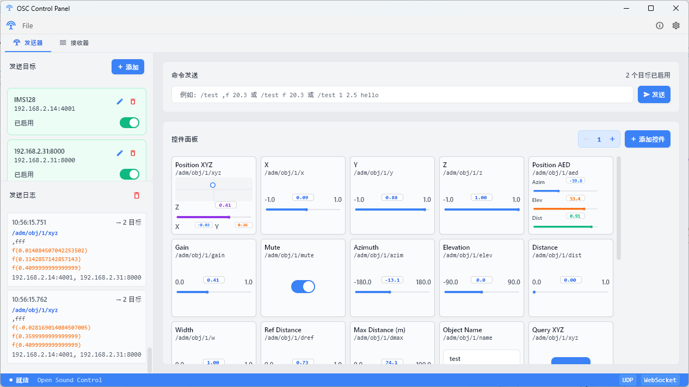
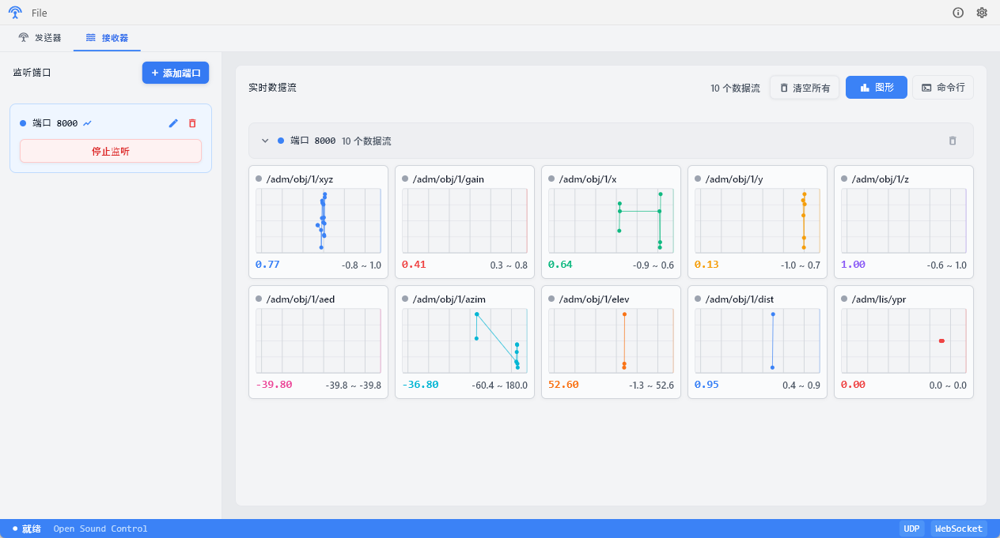

# OSC Controller

[](https://github.com/startpanda/osc-controller)
[](https://opensource.org/licenses/MIT)
[](https://github.com/startpanda/osc-controller/releases/tag/v1.0.0)
[](https://flutter.dev)
[](https://dart.dev)
[](https://opensoundcontrol.stanford.edu/)
[](https://github.com/startpanda/osc-controller)
[](https://github.com/startpanda/osc-controller/releases)
[](https://github.com/startpanda/osc-controller/pulls)

基于 Flutter 的跨平台 OSC（Open Sound Control）桌面工具，支持通用 OSC 发送 / 接收，并完整实现 **ADM OSC v1.0** 规范（三维音频对象位置、增益、方位角等专业控件）。

---

## 功能概览

| 功能模块 | 能力描述 |
| --- | --- |
| OSC 发送器 | 多目标 UDP 同时发送，支持 12 种数据类型编解码，命令行式快捷发送 |
| OSC 接收器 | 多端口同时监听，实时数据流可视化，图形 / 终端双视图模式 |
| 自定义控件 | 9 种控件类型：滑块 / 开关 / 按钮 / XY 板 / 文本输入 / 颜色选择器 / ADM 专用控件 |
| ADM OSC | 22 个预设控件，覆盖对象 / 监听器 / 环境全部消息类型，支持查询消息 |
| 配置管理 | JSON 导入 / 导出，防抖持久化，配置迁移兼容 |

---

## 发送器：精确控制每一个音频对象

发送器界面采用 IDE 风格左右分栏：左侧为目标管理和发送日志，右侧为命令发送面板与控件面板。



*图 1：发送器界面，展示 ADM OSC 控件面板*

### 多目标发送管理

左侧边栏可同时配置多个目标设备。每个目标包含 IP、端口与自定义标签，可通过开关独立启用 / 禁用。发送时会向所有已启用目标同时发包，失败目标会在日志中以红色标注。

### 灵活的命令语法

命令发送面板支持三种 OSC 命令语法：

```text
/test ,f 20.3          // 标准类型标签格式
/test f 20.3           // 简写类型提示格式
/test 1 2.5 hello      // 自动类型检测格式
```

### 九种控件类型

控件面板支持 9 种控件类型，每个控件对应一个 OSC 地址，修改时实时发送：

| 控件 | OSC 类型 | 典型场景 |
| --- | --- | --- |
| 滑块 | float / int | 增益、音量、距离 |
| 开关 | T / F 或自定义值 | 静音、旁通、启用 |
| 按钮 | Impulse / 无参数 | BANG 触发、GET 查询 |
| XY 触控板 | 两个 float | 平面坐标控制 |
| 文本输入 | string | 对象名称、场景标签 |
| 颜色选择器 | RGBA | 可视化配色 |
| ADM XYZ | 三个 float | 三维空间位置 |
| ADM YPR | 三个 float | 偏航 / 俯仰 / 翻滚 |
| ADM AED | 三个 float | 方位角 / 仰角 / 距离 |

### ADM OSC 预设

内置 22 个符合 ADM-OSC v1.0 的预设控件，覆盖对象、监听器与环境消息。地址格式为 `/adm/obj/{n}/{suffix}`，顶部通道选择器可一键切换对象并自动更新关联控件地址。

---

## 接收器：实时数据可视化

接收器提供 **图形视图** 与 **终端视图** 两种模式。



*图 2：接收器图形视图，实时数据流可视化*

### 图形视图

每个 OSC 数据流配有实时折线图（约 30 秒滚动窗口），卡片中展示：

- 5 秒间隔网格线，时间轴自动滚动
- 当前值、最小 / 最大范围统计
- 8 种循环颜色自动分配，便于区分不同地址
- 约 90 秒数据历史，过期自动清理
- 数据流活跃状态指示（约 200ms 超时检测）

### 终端视图

黑色终端风格日志，彩色区分时间戳、源地址、监听端口、OSC 地址与参数值，支持选中复制，便于调试分析。

---

## 适用场景

- **沉浸式音频制作**：Dolby Atmos、MPEG-H 等场景下实时控制对象空间参数
- **舞台演出控制**：通过 OSC 联动灯光、音响、视频系统
- **协议调试**：多目标发送、多端口监听、实时可视化
- **交互装置艺术**：为 TouchDesigner、Max/MSP、Unity 等提供 OSC 控制端

---

## 运行与构建

**要求：** Flutter 3.41+ / Dart 3.11+

```bash
flutter pub get
flutter run -d windows
```

```bash
flutter build windows --release
flutter build macos --release
flutter build linux --release
```

Windows 产物目录：`build/windows/x64/runner/Release/`

技术栈：Flutter / Dart / OSC 1.0 / ADM-OSC v1.0
